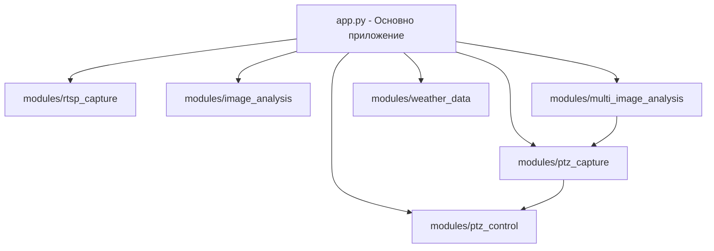

# План за миграция от ONVIF към imouapi

## Въведение

Този документ представя подробен план за замяна на ONVIF протокола с библиотеката imouapi за управление на PTZ камерите в системата ObzorWeather, която работи в Hugging Face Space среда. Миграцията се налага поради спецификите на използвания хардуер (Imou камери), за които ONVIF не е оптимално решение.

## 1. Анализ на текущата архитектура

### 1.1 Основни компоненти



### 1.2 Текущи файлове и тяхната роля

| Файл | Роля |
|------|------|
| `app.py` | Основно FastAPI приложение, инициализира всички модули |
| `requirements.txt` | Списък с Python зависимости |
| `Dockerfile` | Описва контейнеризацията на приложението |
| `modules/ptz_control/controller.py` | Имплементация на ONVIF контрол на камера |
| `modules/ptz_control/config.py` | Конфигурация на PTZ контрол |
| `modules/ptz_control/api.py` | REST API за управление на камерата |
| `modules/ptz_capture/capture.py` | Модул за заснемане, който използва PTZ контрол |
| `templates/ptz_index.html` | Потребителски интерфейс за управление на PTZ |

### 1.3 Imou API данни

- **App Name**: obzor
- **AppId**: lcb51c9bdb8b44452f
- **AppSecret**: ea9432614b9a461ab7928f03d14a3f
- **Serial Number**: B2762ADPCG9BBD4
- **Модел**: IPCK7CP3H1WE

## 2. Предизвикателства и решения

### 2.1 Съхранение на идентификационни данни в Hugging Face среда

**Проблем**: Hugging Face Space изисква съхранение на тайни чрез системата за секрети, не директно в кода.

**Решение**: Добавяне на следните секрети в Hugging Face Space, съгласно съществуващия модел използван за ANTHROPIC_API_KEY:

```
IMOU_APP_ID: lcb51c9bdb8b44452f
IMOU_APP_SECRET: ea9432614b9a461ab7928f03d14a3f
IMOU_DEVICE_SN: B2762ADPCG9BBD4
```

```python
# Пример за четене на тайни в Hugging Face Space
import os
app_id = os.environ.get("IMOU_APP_ID")
app_secret = os.environ.get("IMOU_APP_SECRET")
device_sn = os.environ.get("IMOU_DEVICE_SN")
```

### 2.2 Интеграция на PTZ capture модула

**Проблем**: Модулът за захващане (ptz_capture) директно използва функциите от контролния модул (ptz_control).

**Решение**: Осигуряване на съвместимост чрез запазване на същия публичен интерфейс за функциите `move_to_position` и `get_current_position` в controller.py.

### 2.3 Асинхронен vs. синхронен код

**Проблем**: imouapi библиотеката е базирана на asyncio, докато текущата имплементация е синхронна.

**Решение**: Имаме два възможни подхода:

#### 2.3.1 Подход с минимални промени (препоръчителен)

Създаване на обвиващи (wrapper) функции, които изпълняват асинхронен код в синхронен контекст:

```python
def run_async(coro):
    """Изпълнява асинхронна функция в синхронен контекст"""
    try:
        loop = asyncio.get_event_loop()
    except RuntimeError:
        loop = asyncio.new_event_loop()
        asyncio.set_event_loop(loop)
    
    return loop.run_until_complete(coro)

async def async_move_to_position(position_id: int) -> bool:
    # Асинхронна имплементация...

def move_to_position(position_id: int) -> bool:
    """Синхронен wrapper за преместване към позиция"""
    return run_async(async_move_to_position(position_id))
```

**Предимства**:
- Минимални промени в съществуващия код
- Запазване на публичния API, използван от други модули
- По-малък риск от грешки
- По-бързо внедряване

**Недостатъци**:
- Не е оптимално от гледна точка на производителност
- Може да води до създаване на множество event loops
- Не използва пълния потенциал на асинхронното програмиране

#### 2.3.2 Пълна миграция към асинхронно програмиране

Преработка на всички зависими модули за работа с асинхронен код:

```python
# Трябва да се променят:
# 1. modules/ptz_control/controller.py
# 2. modules/ptz_control/api.py
# 3. modules/ptz_capture/capture.py
# 4. Всички други модули, които използват PTZ контрол
```

**Предимства**:
- По-добра производителност
- Консистентен код
- По-ефективно използване на ресурсите

**Недостатъци**:
- Изисква значителни промени в кода
- По-висок риск от грешки и регресии
- Засяга множество модули
- По-дълго време за внедряване

За този проект **препоръчваме първия подход**, тъй като той предлага добър баланс между бързина на имплементация и риск. Функционалността на PTZ контрол не изисква мащабна паралелна обработка, поради което загубата на производителност от адаптерния подход би била минимална.

## 3. Подробен план за имплементация

### 3.1 Актуализиране на зависимостите

#### 3.1.1 requirements.txt

```diff
+ imouapi>=1.0.15 # Python библиотека за Imou Life API
- onvif-zeep==0.2.12 # Премахваме ONVIF зависимостта или я запазваме за съвместимост
```

### 3.2 Актуализиране на конфигурационния модул (modules/ptz_control/config.py)

```python
import os
from pydantic import BaseModel
from datetime import datetime
from typing import Optional, List, Dict, Any

class PTZControlConfig(BaseModel):
    """Конфигурационен модел за PTZ контрол"""
    # Imou API конфигурация
    app_id: str
    app_secret: str
    device_serial_number: str
    
    # Запазваме съществуващата конфигурация за съвместимост
    camera_ip: Optional[str] = None
    camera_port: Optional[int] = None
    username: Optional[str] = None
    password: Optional[str] = None
    wsdl_path: Optional[str] = None
    
    # Останалите конфигурации остават същите
    positions: Dict[int, Dict[str, Any]] = {
        0: {"name": "Покой", "description": "Позиция в покой"},
        1: {"name": "Изток", "description": "Гледа на изток"},
        2: {"name": "Запад", "description": "Гледа на запад"},
        3: {"name": "Север", "description": "Гледа на север"},
        4: {"name": "Юг", "description": "Гледа на юг"}
    }
    move_speed: float = 0.5
    status: str = "initializing"
    last_move_time: Optional[datetime] = None
    current_position: int = 0

# Глобална конфигурация на модула с данни от околната среда
_config = PTZControlConfig(
    app_id=os.environ.get("IMOU_APP_ID", "lcb51c9bdb8b44452f"),
    app_secret=os.environ.get("IMOU_APP_SECRET", "ea9432614b9a461ab7928f03d14a3f"),
    device_serial_number=os.environ.get("IMOU_DEVICE_SN", "B2762ADPCG9BBD4"),
    
    # Запазваме оригиналните полета за съвместимост
    camera_ip=os.getenv("PTZ_CAMERA_IP", "192.168.1.100"),
    camera_port=int(os.getenv("PTZ_CAMERA_PORT", "8899")),
    username=os.getenv("PTZ_USERNAME", "admin"),
    password=os.getenv("PTZ_PASSWORD", "admin")
)
```

### 3.3 Актуализиране на контролния модул (modules/ptz_control/controller.py)

```python
# Файл: modules/ptz_control/controller.py
"""
Логика за контрол на PTZ камера чрез Imou Life API
"""

import time
import threading
import asyncio
from datetime import datetime
from typing import Optional, Dict, Any, Tuple, List

# Импортиране на imouapi
from imouapi.api import ImouAPIClient
from imouapi.device import ImouDevice
from imouapi.exceptions import ImouAPIException

from .config import get_ptz_config, update_ptz_config
from utils.logger import setup_logger

# Инициализиране на логър
logger = setup_logger("ptz_controller")

# Глобални променливи
api_client = None
imou_device = None

# Функция за изпълнение на асинхронен код синхронно
def run_async(coro):
    """Изпълнява асинхронна функция в синхронен контекст"""
    try:
        loop = asyncio.get_event_loop()
    except RuntimeError:
        loop = asyncio.new_event_loop()
        asyncio.set_event_loop(loop)
    
    return loop.run_until_complete(coro)

async def async_initialize_camera() -> bool:
    """Асинхронно инициализира Imou устройството"""
    global api_client, imou_device
    
    config = get_ptz_config()
    
    try:
        logger.info(f"Свързване с Imou API, устройство SN: {config.device_serial_number}")
        
        # Създаваме API клиент
        api_client = ImouAPIClient(config.app_id, config.app_secret)
        
        # Създаваме устройство
        imou_device = ImouDevice(api_client, config.device_serial_number)
        
        # Проверяваме връзката с устройството
        device_info = await imou_device.get_device_info()
        
        if device_info:
            logger.info(f"Успешно свързване с Imou устройство: {device_info.name}")
            update_ptz_config(status="ok")
            return True
        else:
            logger.error("Не може да се получи информация за устройството")
            update_ptz_config(status="error")
            return False
            
    except Exception as e:
        logger.error(f"Грешка при свързване с Imou устройство: {str(e)}")
        update_ptz_config(status="error")
        return False

def initialize_camera() -> bool:
    """Инициализира връзка с PTZ камерата (синхронен wrapper)"""
    return run_async(async_initialize_camera())

async def async_move_to_position(position_id: int) -> bool:
    """Асинхронно премества камерата към предефинирана позиция"""
    global imou_device
    
    config = get_ptz_config()
    
    if not imou_device:
        logger.error("Imou устройството не е инициализирано")
        return False
    
    if position_id not in config.positions:
        logger.error(f"Невалидна позиция: {position_id}")
        return False
    
    try:
        # Конвертиране на позицията към Imou пресет (1-8 вместо 0-7)
        preset_id = position_id + 1
        
        logger.info(f"Преместване към preset {preset_id} (позиция {position_id})")
        
        # Извикваме Imou API за преместване към пресет
        await imou_device.go_to_preset(preset_id)
        
        # Обновяваме текущата позиция
        update_ptz_config(
            current_position=position_id,
            last_move_time=datetime.now()
        )
        
        return True
        
    except Exception as e:
        logger.error(f"Грешка при преместване към позиция {position_id}: {str(e)}")
        return False

def move_to_position(position_id: int) -> bool:
    """Премества камерата към предефинирана позиция (синхронен wrapper)"""
    return run_async(async_move_to_position(position_id))

async def async_stop_movement() -> bool:
    """Асинхронно спира движението на камерата"""
    global imou_device
    
    if not imou_device:
        logger.error("Imou устройството не е инициализирано")
        return False
    
    try:
        await imou_device.stop_ptz_movement()
        logger.info("Камерата е спряна")
        return True
        
    except Exception as e:
        logger.error(f"Грешка при спиране на камерата: {str(e)}")
        return False

def stop_movement() -> bool:
    """Спира движението на камерата (синхронен wrapper)"""
    return run_async(async_stop_movement())

async def async_get_current_position() -> Dict[str, Any]:
    """Асинхронно връща текущата позиция на камерата"""
    global imou_device
    
    config = get_ptz_config()
    
    if not imou_device:
        logger.error("Imou устройството не е инициализирано")
        return {"error": "Imou устройството не е инициализирано"}
    
    try:
        # imouapi не поддържа директно получаване на текуща позиция
        # връщаме информация базирана на последното известно преместване
        
        return {
            "position_id": config.current_position,
            "position_name": config.positions[config.current_position]['name'],
            "last_move_time": config.last_move_time.isoformat() if config.last_move_time else None
        }
        
    except Exception as e:
        logger.error(f"Грешка при получаване на текущата позиция: {str(e)}")
        return {"error": str(e)}

def get_current_position() -> Dict[str, Any]:
    """Връща текущата позиция на камерата (синхронен wrapper)"""
    return run_async(async_get_current_position())

def initialize() -> bool:
    """Инициализира PTZ контрол модула"""
    success = initialize_camera()
    
    if success:
        logger.info("PTZ контрол модул инициализиран успешно")
    else:
        logger.error("Грешка при инициализиране на PTZ контрол модул")
    
    return success

# Автоматично инициализиране при импорт
initialize()
```

### 3.4 Актуализиране на API модула (modules/ptz_control/api.py)

Не са необходими значителни промени в API модула, тъй като публичният интерфейс остава същият. Единствено трябва да се обновят формулярите за включване на imouapi полета.

### 3.5 Актуализиране на PTZ HTML шаблона (templates/ptz_index.html)

Добавяне на нови полета за Imou API данни във формуляра за конфигурация:

```html
<div class="config-form">
    <h2>Настройки на PTZ модула</h2>
    <form id="configForm" onsubmit="return updateConfig(event)">
        <!-- Нова секция за Imou API настройки -->
        <div class="form-group">
            <h3>Imou API настройки</h3>
            
            <div class="form-group">
                <label for="app_id">Imou App ID:</label>
                <input type="text" id="app_id" name="app_id" value="{{ config.app_id }}">
            </div>
            
            <div class="form-group">
                <label for="app_secret">Imou App Secret:</label>
                <input type="password" id="app_secret" name="app_secret" placeholder="Въведете App Secret">
            </div>
            
            <div class="form-group">
                <label for="device_serial_number">Сериен номер на устройството:</label>
                <input type="text" id="device_serial_number" name="device_serial_number" value="{{ config.device_serial_number }}">
            </div>
        </div>
        
        <!-- Останалата част от формуляра остава непроменена -->
        <!-- ... -->
        
        <button type="submit">Запази настройките</button>
    </form>
</div>
```

### 3.6 Актуализиране на app.py

Добавяне на проверка за наличието на Imou API секрети:

```python
# Проверка за наличие на Imou API данни
if not (os.getenv("IMOU_APP_ID") and os.getenv("IMOU_APP_SECRET") and os.getenv("IMOU_DEVICE_SN")):
    logger.warning("IMOU_APP_ID, IMOU_APP_SECRET или IMOU_DEVICE_SN не са налични! PTZ Control модулът ще използва стойности по подразбиране.")
```

### 3.7 Актуализиране на README.md

Добавяме информация за новите настройки и секрети:

```markdown
## Настройка

1. Добавете необходимите секрети в Hugging Face Space настройките:
   - `ANTHROPIC_API_KEY`: API ключ за Anthropic (необходим за AI анализа)
   - `IMOU_APP_ID`: Imou Life Open API App ID 
   - `IMOU_APP_SECRET`: Imou Life Open API App Secret
   - `IMOU_DEVICE_SN`: Сериен номер на Imou устройството
   
   Следните секрети се запазват за съвместимост, но вече не са задължителни:
   - `PTZ_CAMERA_IP`: IP адрес на PTZ камерата (по подразбиране: 192.168.1.100)
   - `PTZ_USERNAME`: Потребителско име за PTZ камерата (по подразбиране: admin)
   - `PTZ_PASSWORD`: Парола за PTZ камерата (по подразбиране: admin)
```

## 4. Съображения относно асинхронната vs. синхронна архитектура

### 4.1 Текущо състояние на кода

- **FastAPI основа**: Приложението използва FastAPI, който е по природа асинхронен фреймуърк
- **Асинхронни ендпойнти**: API ендпойнтите в app.py са дефинирани като `async def`
- **Синхронна вътрешна логика**: Вътрешните функции в модулите са синхронни
- **Thread-базирани процеси**: Модулът ptz_capture използва threading за продължителни операции

### 4.2 Възможности за дългосрочно развитие

#### 4.2.1 Пълна асинхронна миграция (дългосрочно)

Ако приложението продължи да расте и да има нужда от по-добра мащабираемост, струва си да се обмисли пълна миграция към асинхронен код:

1. Премахване на всички синхронни wrapper-и
2. Преработка на ptz_capture за използване на asyncio вместо threading
3. Осигуряване на директни асинхронни интерфейси между модулите

```python
# Бъдеща асинхронна архитектура

# modules/ptz_control/controller.py
async def move_to_position(position_id: int) -> bool:
    # Директно асинхронно имплементиране
    
# modules/ptz_capture/capture.py
async def capture_position_frame(position_id: int) -> bool:
    # Асинхронно имплементиране без run_async wrapper-и
    
# Замяна на threading с asyncio.Task
async def capture_loop():
    while config.running:
        await asyncio.sleep(10)  # Неблокиращо изчакване
```

#### 4.2.2 Предпазни мерки за сегашната хибридна имплементация

За да осигурим, че текущата имплементация с хибридна асинхронно-синхронна архитектура работи правилно:

1. **Оптимизация на run_async**: Функцията трябва да опитва да използва съществуващ event loop, преди да създаде нов
2. **Избягване на дълбоко влагане**: Минимизиране на случаите на извикване на синхронна -> асинхронна -> синхронна функция
3. **Мониторинг на производителността**: Наблюдение за проблеми с производителността и memory leaks

## 5. Тестване и валидация

### 5.1 Модулно тестване

1. **Тестване на конфигурационния модул**:
   - Проверка за правилно зареждане на Imou API данни
   - Проверка за правилна обработка на липсващи данни

2. **Тестване на контролния модул**:
   - Проверка на инициализация с Imou API
   - Проверка на функциите за движение и позициониране
   - Проверка на обработката на грешки при недостъпен сървър

### 5.2 Интеграционно тестване

1. **Тестване на интеграцията с PTZ Capture модула**:
   - Проверка дали заснемането работи правилно с новия контролен модул
   - Проверка на цикъла на заснемане от всички позиции

2. **Тестване на уеб интерфейса**:
   - Проверка на новите полета във формуляра за конфигурация
   - Проверка на обновяване на настройките

## 6. Стратегия за внедряване

### 6.1 Подготвителни стъпки

1. Добавяне на секрети в Hugging Face Space:
   - `IMOU_APP_ID`: lcb51c9bdb8b44452f
   - `IMOU_APP_SECRET`: ea9432614b9a461ab7928f03d14a3f
   - `IMOU_DEVICE_SN`: B2762ADPCG9BBD4

2. Актуализиране на requirements.txt с новата зависимост imouapi.

### 6.2 Имплементация

1. Актуализиране на config.py модула с поддръжка на Imou API данни.
2. Замяна на controller.py с новата имплементация, използваща imouapi.
3. Актуализиране на шаблона ptz_index.html с нови полета за конфигурация.
4. Актуализиране на app.py с проверка за Imou API данни.
5. Актуализиране на README.md с нови инструкции.

### 6.3 Тестване в производствена среда

1. Внедряване на промените в тестова среда.
2. Проверка на всички функционалности.
3. Мониторинг за грешки и проблеми.
4. Преминаване към пълно внедряване.

## 7. Конфигуриране на пресети в Imou камерата

### 7.1 Предварителна подготовка на пресети

Преди да използвате новата имплементация, трябва да конфигурирате пресетите в камерата:

1. Използвайте официалното Imou приложение за да настроите следните пресети:
   - Preset 1: Покой
   - Preset 2: Изток
   - Preset 3: Запад
   - Preset 4: Север
   - Preset 5: Юг

2. Приложението ще преобразува вътрешно позиции 0-4 към пресети 1-5.

## 8. Потенциални проблеми и решения

### 8.1 Проблеми с асинхронността

**Проблем**: imouapi използва asyncio, което може да създаде проблеми в синхронен контекст.

**Решение**: Използването на функцията `run_async` позволява изпълнение на асинхронни функции в синхронен контекст.

### 8.2 Ограничения на Imou API

**Проблем**: Не всички функции на ONVIF може да имат директни еквиваленти в Imou API.

**Решение**: Имплементиране на "обходни решения" (workarounds) където е необходимо.

### 8.3 Ограничения на Hugging Face Space

**Проблем**: Hugging Face Space може да има ограничения за изходящи заявки.

**Решение**: Осигуряване на подходяща обработка на грешки и повторни опити при мрежови проблеми.

## 9. Заключение

Миграцията от ONVIF към imouapi ще подобри съвместимостта и надеждността на PTZ функционалността за използваните Imou камери. Предложеният план осигурява плавен преход с минимално въздействие върху другите модули на системата.

Въпреки че текущата имплементация използва хибриден подход с асинхронно-синхронни wrapper-и, това решение предоставя добър баланс между бързина на внедряване и поддръжка на съществуващия код. В бъдеще, ако системата има нужда от по-добра мащабируемост, може да се обмисли пълна миграция към асинхронно програмиране.